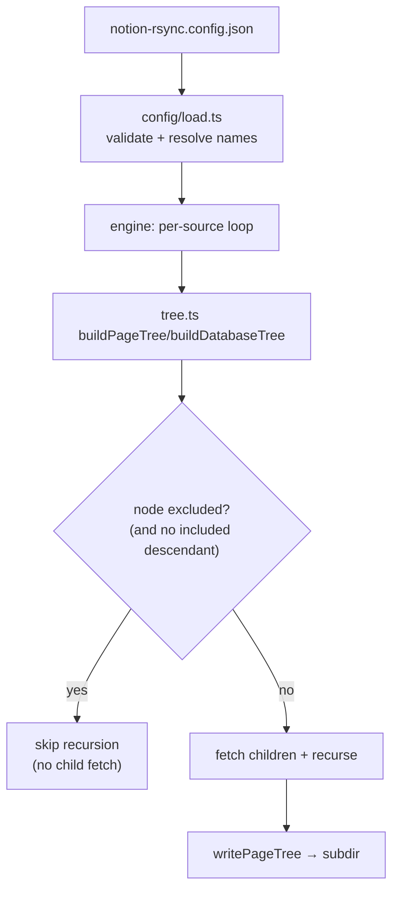

# Config File + Selective Sync Plan

**Status:** 🟢 Implemented (config file + selectors + date filtering)
**Last updated:** Jul 21, 2026
**Fork:** `crimsonsunset/notion-rsync` (parent `nonfx/notion-sync`), branch TBD off `master` (v0.2.0)
**Scope:** Add a user-facing config file that declares multiple Notion roots and per-root include/exclude selectors (by ID or title glob), with pruning applied at tree-build time so excluded subtrees are never crawled. Targets upstream `TODO.md` Phase 2.6 ("Selective sync (include/exclude patterns)"), currently unchecked.
**Related:** [jsg-tech-check `rivendell-notion-sync-wiring-plan.md`](https://github.com/crimsonsunset/jsg-tech-check/blob/master/docs/planning/rivendell-notion-sync-wiring-plan.md) (the consumer — this feature unblocks its Phase 3 curated pull) · upstream `TODO.md` Phase 2.6 · `AGENTS.md` (repo stack + structure)

---

## TL;DR

`notion-rsync` today syncs exactly one root per output dir, chosen once via `init` and stored in `.notion-rsync/index.json`. There is no way to (a) drive several roots from one invocation or (b) exclude a subtree. The existing `--pages` flag looks like selective sync but isn't: `partial.ts` still builds the *entire* page tree and only filters which pages get their blocks fetched. It saves nothing on the crawl, which is the expensive, rate-limited part.

This plan adds a `notion-rsync.config.json` file: a `sources[]` array (each root to its own subdir) plus per-source `include`/`exclude` selectors that accept either a Notion ID or a title-path glob. The critical difference from `--pages` is that exclusion prunes during `buildPageTree`/`buildDatabaseTree` recursion, so an excluded subtree is never fetched. That both delivers the feature and structurally prevents the parallel-crawl rate-limit blowups this tool is prone to on large workspaces.

The work is scoped to land as an upstream PR against Phase 2.6, keeping the fork on the upstream release train rather than a permanent hard fork.

---

## Overview

**What this is:** A declarative config layer on top of the existing pull engine. One file lists which Notion roots to pull, where each lands, and what to keep or drop inside each. The engine gains build-time pruning so filtering is cheap, not cosmetic.

**What this is NOT:** Not a rewrite of the pull engine. `engine.ts`, the markdown writer, and the state index stay as-is; they get wrapped and parameterized, not replaced. Not a push/Stage-2 change. Not the Rivendell deploy or the knowledge-base `scan-sources.json` wiring — those live in the consumer plan (`rivendell-notion-sync-wiring-plan.md` Phase 3) and only start once this feature ships and the fork is installed.

**Why now:** The consumer (KB ingestion on Rivendell) needs curated inclusion, not a full-workspace dump, and hit hard Notion rate limits attempting the naive multi-root crawl. Upstream already lists this exact capability as a roadmap item, so building it as a contribution is cheaper long-term than carrying a private patch.

**Dependency chain:**

```
notion-rsync.config.json parsed + validated (schema, loader)
  ↓
sources[] resolved (name → id, output subdirs computed)
  ↓
multi-source orchestration: existing sync run per source into its subdir
  ↓
build-time selector pruning in tree.ts (id + glob, include-override)
  ↓
excluded subtrees never crawled → fewer API calls, no rate-limit blowup
  ↓
upstream PR against TODO.md Phase 2.6; fork installable on Rivendell
```

---

## Decisions

| # | Decision | Rationale |
|---|---|---|
| 1 | Config file is separate from the state index: `notion-rsync.config.json` (user-authored, versionable) vs `.notion-rsync/index.json` (tool-managed state) | The index tracks page→path state for idempotency and stale-file cleanup; it is not something a human edits. Overloading it with user intent would conflate durable state with declarative config and break the existing single-root `init` flow for anyone already using it. |
| 2 | Selectors accept **either** a 32-hex Notion ID **or** a title-path glob; ID wins on conflict | IDs are stable and unique (a rename does not break config, and the workspace has 5+ pages literally named some flavor of "Todos"). Globs are the readable convenience for coarse rules (`**/Archive/**`). Supporting both lets precision and ergonomics coexist instead of forcing one. |
| 3 | Pruning happens at tree-build time (skip recursion in `buildPageTree`/`buildDatabaseTree`), NOT post-filter like `partial.ts` | `--pages`/`partial.ts` builds the full tree then filters block-fetching, so the crawl cost (and rate-limit exposure) is unchanged. Deciding to skip a node before recursing into its children is the only version that actually saves API calls, which is the whole point on large workspaces. A node's title and ID are both known before its children are fetched, so both selector types can prune early. |
| 4 | Multi-root via `sources[]`, each to its own output subdir, supersedes the single `rootPageId` model for config-driven runs | The target workspace is not one tree (HQ has many top-level pages). One state index per source subdir keeps each root independently idempotent and cleanly separated on disk, reusing the existing per-dir index machinery unchanged. Single-root `init`/`sync` stays supported for backward compatibility. |
| 5 | `name` on a source/selector is a load-time alias resolved to an ID, never the match key | Config stays readable (`"name": "Professional TODOs"`) while the authoritative key remains the stable ID. Resolution happens once at load via the API; ambiguous or missing names fail loudly at load, not silently mid-crawl. |
| 6 | Include-override negation is supported but not required for the motivating case | "Keep one child of an otherwise-excluded parent" is expressible as `exclude` parent + `include` the child. But because a kept child usually has its own ID, it can instead be its own `sources[]` entry, avoiding any traversal into the excluded parent. Negation exists for genuinely buried keepers; the common case does not pay for it. |
| 7 | Track latest upstream (v0.2.0+); pull-only is enforced by discipline, not by binary absence | Rivendell is now upgraded from the old 0.1.5 pin to latest (0.2.0, which has `push`). The version-pinning dance was more confusing than the risk it hedged, so it is dropped. Pull-only is now a convention: the Rivendell cron wrapper only ever invokes `sync`, never `push`. This keeps the fork rebasable on upstream instead of stranded on a two-releases-old base. |
| 8 | Ship as an upstream PR against Phase 2.6, not a private-only patch | Keeps the fork rebasable on upstream releases instead of drifting into an unmaintainable hard fork. The feature is already on their roadmap, so acceptance odds are good, and even if it stalls the branch is self-contained and installable directly. |

---

## Scope

### In scope

- `notion-rsync.config.json` schema: global block (`output`, `concurrency`, `retry`, `defaultExclude`, `defaultDateFilter`) + `sources[]` (`id`, `name?`, `output`, `include?`, `exclude?`, `maxDepth?`, `dateFilter?`)
- Config discovery (cwd default) and explicit `--config <path>` flag
- Loader with validation and `name` → ID resolution at load time
- Multi-source orchestration: run the existing pull per source into its own subdir under the global `output`
- Build-time selector pruning in `tree.ts` for both ID and title-glob selectors, with include-override
- `defaultExclude` globs merged into every source's exclude set
- Wire `concurrency` and `retry` from config into the existing constants/retry path (expose the two knobs that cause rate-limit pain today)
- Dry-run (`-n`) prints the resolved plan: each source, output subdir, and the effective include/exclude after resolution
- Tests (Bun) for schema validation, selector matching (id + glob + negation), and pruning behavior
- Docs: `README.md` config section, `TODO.md` Phase 2.6 checked, `CHANGELOG.md` entry, a `notion-rsync.config.example.json`

### Out of scope

- **Push / Stage-2 changes** — this feature is pull-only; push behavior is untouched (Decision #7)
- **Watch mode, hooks, backup-before-sync, auth profiles** — upstream `TODO.md` Phase 2.6 adjacencies, but scheduling/triggering already live in the consumer's launchd + Windmill stack; building them here duplicates that (YAGNI)
- **Rivendell deploy of the fork** — belongs to `rivendell-notion-sync-wiring-plan.md` Phase 3, gated on this shipping
- **knowledge-base `scan-sources.json` wiring** — also consumer-plan Phase 3; this plan stops at "curated markdown lands in `notion-export/`"
- **Rate-limit/retry redesign** — only exposing the existing `withRetry` knobs via config; no new backoff algorithm

---

## Architecture

### Config shape

```jsonc
{
  "output": "./notion-export",     // global output root (default ./docs)
  "concurrency": 2,                // maps to tree.ts CONCURRENCY
  "retry": { "attempts": 6 },      // maps to withRetry
  "defaultExclude": ["**/Archive/**"],
  "defaultDateFilter": { "after": "2025-01-01" },
  "sources": [
    {
      "id": "d95e4b1bba544a1794a68c9005e4fa0a",
      "name": "Professional TODOs",   // doc alias, resolved to id at load
      "output": "professional-todos"  // subdir under global output
    },
    {
      "id": "2df24584254b804094d3dfb56506b0be",
      "name": "Sync2Hire",
      "output": "sync2hire",
      "exclude": [
        "**/Archive/**",                        // glob on title-path
        "9ded838dec5c451498cc03000357ca50"      // or a raw id
      ],
      "dateFilter": { "after": "2026-01-01" }  // per-source date range (see below)
    }
  ]
}
```

### Date filtering (`dateFilter` / `defaultDateFilter`)

A second scoping axis alongside `include`/`exclude`: pages are filtered by `last_edited_time` after the node is fetched. ISO-8601 date strings only (e.g. `"2026-01-01"`, `"2026-01-01T00:00:00.000Z"`).

| Field | Scope | Description |
|---|---|---|
| `defaultDateFilter` | Global | Applied to every source; intersects with per-source bounds |
| `sources[].dateFilter` | Per-source | Optional `after` and/or `before` bounds on `last_edited_time` |

**Intersection semantics:** When both global and per-source bounds are set, the effective range is the intersection — the later `after` wins, the earlier `before` wins. Mirrors `defaultExclude` additive narrowing rather than override.

**Bounds:**

- `after` — exclude pages edited strictly before this timestamp (inclusive at the parsed instant)
- `before` — exclude pages edited after the end of the configured calendar day (UTC)

**Unlike ID/glob exclude, date exclude never prunes child fetches.** A parent edited long ago may still have children edited yesterday; those children are fetched and evaluated on their own `last_edited_time`. Date exclusion ORs into the same `excluded` flag used by selectors, so `writer.ts` and stale cleanup behave identically: a childless date-excluded page produces no file and falls out of the index on the next run.

Dry-run prints the effective date range per source after intersection:

```bash
notion-rsync sync --config notion-rsync.config.json -n
# ...
#   Default dateFilter: after 2025-01-01
#   source "Sync2Hire" → ./notion-export/sync2hire
#     effective dateFilter: after 2026-01-01
```

Validation rejects malformed date strings and configs where `after` is later than `before`.

### Selector resolution

A selector string is classified once: if it matches `/^[0-9a-f]{32}$/` (after stripping dashes) it is an **ID selector**, otherwise a **glob selector** matched against the node's title-path relative to its source root (e.g. `Sync2Hire/Archive/Old Note`). Precedence per node: explicit `include` ID > explicit `exclude` ID > `include` glob > `exclude` glob > `defaultExclude` glob > default-include.

### Pruning point



The decision runs *before* `fetchChildren` for each node, so an excluded subtree costs one page fetch (to learn the node's title/id) at most, not a full descendant crawl. Contrast `partial.ts`, which builds the whole tree first.

---

## Files to Create

| File | Purpose |
|---|---|
| `src/config/schema.ts` | Config TypeScript types + a validation function (shape, required fields, selector well-formedness) |
| `src/config/load.ts` | Discover/read/parse config, resolve `name` → id via the API, compute effective per-source selector sets |
| `src/config/selector.ts` | Classify a selector (id vs glob), match a node against a resolved selector set, apply precedence |
| `notion-rsync.config.example.json` | Documented example config committed at repo root |
| `docs/config-file-support-plan.md` | This plan |

## Files to Modify

| File | Change |
|---|---|
| `src/cli.ts` | Add `--config <path>`; when a config is present, route `sync` to the multi-source orchestrator instead of single-root |
| `src/sync/engine.ts` | Accept an optional resolved selector set + output subdir per source; thread into tree build |
| `src/notion/tree.ts` | Apply selector pruning before recursion in `buildPageTree`/`buildDatabaseTree`; read `concurrency` from config |
| `src/notion/client.ts` | Read `retry.attempts` from config in `withRetry` (or thread through) |
| `src/sync/index.ts` | Confirm per-subdir state index works for N sources (likely no change; verify) |
| `README.md` | Config file section: schema, selectors, examples |
| `TODO.md` | Check Phase 2.6 "Selective sync (include/exclude patterns)" |
| `CHANGELOG.md` | Entry for config-file + selective sync |

---

## Phasing

### Phase 1: Config schema + loader (~0.5 day)

- `src/config/schema.ts` types + validation
- `src/config/load.ts`: discovery (cwd + `--config`), parse, `name` → id resolution, effective selector computation
- `--config` flag in `cli.ts` routing to a stub orchestrator
- Bun tests for schema validation (good/bad configs) and name resolution

**Outcome:** `notion-rsync sync --config notion-rsync.config.json -n` parses the file, resolves every `name` to an id (failing loudly on a bad/ambiguous name), and prints the resolved source list. No pulling yet, no filtering.

### Phase 2: Multi-source orchestration (~0.5 day)

- Orchestrator loops the existing `sync` per source into `<global output>/<source.output>`
- Reuse per-dir `.notion-rsync/index.json` state unchanged
- Sequential across sources (not parallel) to avoid the known rate-limit trap

**Outcome:** A config with two sources pulls both into separate subdirs in one invocation, each independently idempotent (re-run is a no-op). No include/exclude yet, so full subtrees come down.

### Phase 3: Build-time selector pruning (~1 day)

- `src/config/selector.ts`: id/glob classification + match + precedence
- Wire pruning into `buildPageTree`/`buildDatabaseTree` before `fetchChildren`
- Include-override traversal (walk into an excluded parent only if an included descendant requires it)
- Bun tests for match precedence and negation

**Outcome:** Excluding a subtree by id or glob measurably drops the crawled page count and makes zero API calls into the excluded subtree (verifiable in verbose logs). The motivating case works: a source rooted at Paid Work with everything excluded except Professional TODOs pulls only Professional TODOs.

### Phase 4: Globals + defaults (~0.5 day)

- `defaultExclude` merged into every source
- `concurrency` and `retry.attempts` read from config into `tree.ts`/`client.ts`
- Dry-run prints the effective include/exclude per source after all merges

**Outcome:** One config controls crawl concurrency and retry budget, and a workspace-wide `defaultExclude` (e.g. `**/Archive/**`) applies without repeating it per source. Dry-run shows the fully-resolved plan.

### Phase 5: Upstream PR prep (~0.5 day)

- `README.md` config section, `notion-rsync.config.example.json`, `CHANGELOG.md`, check `TODO.md` Phase 2.6
- Final test pass, lint (OXLint), format (OXFmt)
- Open PR against `nonfx/notion-sync`

**Outcome:** A self-contained PR closing Phase 2.6 is open upstream, and the fork branch is installable on Rivendell (via git or a published build) over the current latest install, unblocking the consumer plan's Phase 3.

---

## Key Files Referenced

| File | What it informs |
|---|---|
| `src/notion/tree.ts` | `buildPageTree`/`buildDatabaseTree`/`fetchChildren` — the recursion where pruning must land (Decision #3) |
| `src/sync/partial.ts` | The existing `--pages` path that filters block-fetch but not the crawl — the anti-pattern this plan avoids |
| `src/sync/engine.ts` | Single-root pull orchestration this plan wraps per-source |
| `src/sync/index.ts` | Per-dir `.notion-rsync/index.json` state, reused one-per-source |
| `src/cli.ts` | Current flags (`-o`, `-p`, `-n`) and command routing to extend with `--config` |
| `TODO.md` (Phase 2.6) | Upstream roadmap item this contribution closes |
| `AGENTS.md` | Repo stack (Bun, OXLint/OXFmt, strict TS) and structure conventions to follow |

---

## Related Documentation

- [jsg-tech-check `rivendell-notion-sync-wiring-plan.md`](https://github.com/crimsonsunset/jsg-tech-check/blob/master/docs/planning/rivendell-notion-sync-wiring-plan.md) — the consumer; its Phase 3 (curated full-workspace pull + `scan-sources.json`) is gated on this feature and the fork deploy
- upstream [`nonfx/notion-sync`](https://github.com/nonfx/notion-sync) `TODO.md` Phase 2.6 — the roadmap item
- `PLAN-STAGE-2.md` — the two-way-sync context (out of scope here, but the base version carries it)

---

_Created: Jul 21, 2026_
